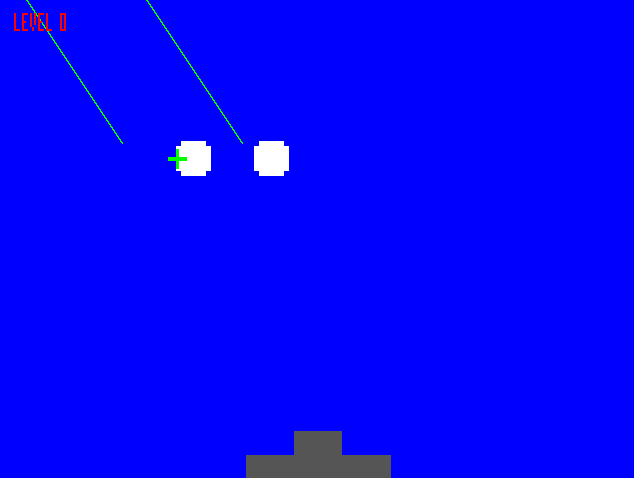

   

# Demoscene Missile Command for TinyTapeout

The Verilog implementation (well sort of) of the classic [Atari's Missile Command](https://atari.com/pages/missilecommand?srsltid=AfmBOoo7Ne8JxmRSx7aoGDwawJRuy56aG9UlHu7-Bxz7Az-XN5kpcaTQ) game.

Easy and fun to play, checkout the [details and required hardware](./docs/info.md) to get started, then just press start and begin the action!

You start at level 0 (see top left screen), and will see the enemy throwing missiles waves with 1 to 3 missiles at a time targetting your gray fortress (bottom center) and you have to defend it!, move the green cursor (crosshair) and press A to throw an anti-aereal defense bomb, if the missiles touches it it will get destroyed and you'll be able to pick the wrecks to study their technology XD.

Expect 10 missiles per level, on each level the missiles speed will increase until crazyness, if you receive 3 impacts to the fortress on the same level you lose, the impacts count will reset on every level change. When you see the GAME OVER banner press start to begin again.

Ready to defend your homeland? 🪖 GO 🪖

## What is Tiny Tapeout?

Tiny Tapeout is an educational project that aims to make it easier and cheaper than ever to get your digital and analog designs manufactured on a real chip.

To learn more and get started, visit https://tinytapeout.com.

## Set up your Verilog project

1. Add your Verilog files to the `src` folder.
2. Edit the [info.yaml](info.yaml) and update information about your project, paying special attention to the `source_files` and `top_module` properties. If you are upgrading an existing Tiny Tapeout project, check out our [online info.yaml migration tool](https://tinytapeout.github.io/tt-yaml-upgrade-tool/).
3. Edit [docs/info.md](docs/info.md) and add a description of your project.
4. Adapt the testbench to your design. See [test/README.md](test/README.md) for more information.

The GitHub action will automatically build the ASIC files using [LibreLane](https://www.zerotoasiccourse.com/terminology/librelane/).

## Enable GitHub actions to build the results page

- [Enabling GitHub Pages](https://tinytapeout.com/faq/#my-github-action-is-failing-on-the-pages-part)

## Resources

- [FAQ](https://tinytapeout.com/faq/)
- [Digital design lessons](https://tinytapeout.com/digital_design/)
- [Learn how semiconductors work](https://tinytapeout.com/siliwiz/)
- [Join the community](https://tinytapeout.com/discord)
- [Build your design locally](https://www.tinytapeout.com/guides/local-hardening/)

## What next?

- [Submit your design to the next shuttle](https://app.tinytapeout.com/).
- Edit [this README](README.md) and explain your design, how it works, and how to test it.
- Share your project on your social network of choice:
  - LinkedIn [#tinytapeout](https://www.linkedin.com/search/results/content/?keywords=%23tinytapeout) [@TinyTapeout](https://www.linkedin.com/company/100708654/)
  - Mastodon [#tinytapeout](https://chaos.social/tags/tinytapeout) [@matthewvenn](https://chaos.social/@matthewvenn)
  - X (formerly Twitter) [#tinytapeout](https://twitter.com/hashtag/tinytapeout) [@tinytapeout](https://twitter.com/tinytapeout)
  - Bluesky [@tinytapeout.com](https://bsky.app/profile/tinytapeout.com)
